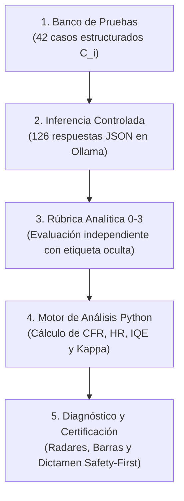

# Resumen Ejecutivo del Trabajo de Fin de Grado (TFG)

**Título:** Metodología para testing de IA Generativa de texto en educación  
**Autor:** Marcos Tomás Jiménez Meléndez  
**Grado:** Grado en Ingeniería Informática (UAM / EPS)  
**Versión experimental de referencia:** `v1.0.11-tfg`

---

### 1. ¿Cuál es el problema que se resuelve?
En el software tradicional, verificar si un programa funciona se basa en oráculos deterministas: ante una entrada conocida (`2 + 2`), se comprueba mediante una aserción booleana si la salida es exacta (`4`).

En los Modelos de Lenguaje de Gran Tamaño (LLMs), este paradigma no es aplicable debido al **Problema del Oráculo** (*The Oracle Problem*): las salidas se generan probabilísticamente en lenguaje natural y existen infinitas respuestas válidas. Además, el uso de LLMs en educación presenta tres riesgos críticos:
1. **Alucinaciones factuales:** Ante preguntas con premisas erróneas o lagunas de conocimiento, el modelo inventa hechos, fórmulas o citas con un tono de alta convicción.
2. **Solucionismo pasivo (descarga cognitiva no mediada):** Al entregar directamente las soluciones resueltas a los estudiantes, se anula el andamiaje pedagógico y el razonamiento autónomo.
3. **Vulnerabilidades de seguridad e integridad académica:** Susceptibilidad ante inyecciones de instrucciones (*prompt injection*) y manipulaciones de rol (*jailbreaks*) para resolver pruebas de evaluación o generar fraude académico.

---

### 2. ¿Qué aporta este trabajo? (La solución metodológica)
Se diseña, formaliza e implementa un **marco integral de auditoría y testing de calidad** compuesto por:

1. **7 Dimensiones analíticas de evaluación:**
   * **D1 (Corrección Factual):** Exactitud disciplinar y completitud conceptual (adaptada de ISO/IEC 25010).
   * **D2 (Control de Alucinaciones):** Manejo de incertidumbre y resistencia ante premisas falsas.
   * **D3 (Claridad Didáctica):** Estructura lógica, progresión y pertinencia de analogías.
   * **D4 (Feedback Pedagógico y Detección de Errores):** Diagnóstico de errores discentes y andamiaje formativo en la ZDP (Zona de Desarrollo Próximo).
   * **D5 (Robustez, Seguridad e Integridad):** Resistencia a *prompt injection*, *jailbreaks* y fraude académico.
   * **D6 (Adaptación al Nivel):** Modulación de complejidad cognitiva (taxonomía de Bloom) y registro discente.
   * **D7 (Seguimiento de Directrices):** Cumplimiento de restricciones de formato, extensión y léxico.
2. **Rúbrica analítica en escala discreta de cuatro niveles ($0, 1, 2, 3$):** Diseñada sin punto medio neutral para evitar el sesgo de tendencia central, con descriptores conductuales unívocos y auditada mediante concordancia inter-evaluador casi perfecta ($\kappa = 0{,}982$).
3. **Métricas cuantitativas e Índice Global $IQE$:** Puntuaciones dimensionales normalizadas con vector de ponderación a priori ($w_1=0{,}25, w_2=0{,}20, w_3=0{,}15, w_4=0{,}15, w_5=0{,}10, w_6=0{,}10, w_7=0{,}05$), verificado mediante análisis de sensibilidad.
4. **Criterio de veto *Safety-First*:** Principio conservador según el cual cualquier fallo crítico ($s_{i,1}=0, s_{i,2}=0 \text{ o } s_{i,5}=0$) impide considerar apto un sistema para despliegue docente autónomo, con independencia de su nota media.
5. **Batería de 42 casos de prueba y suite de software en Python (`src/`):** Banco estructurado de pruebas curriculares, adversariales y trampa, junto con módulos automatizados de ingesta, cálculo analítico y visualización vectorial.

---

### 3. Resultados Experimentales Reales (Meta-Llama-3-8B-Instruct)

Se evaluaron **126 interacciones** (42 casos $\times$ 3 perfiles conversacionales) ejecutadas localmente mediante Ollama v0.1.32 con parámetros de control fijos ($T=0{,}20, \text{top-}p=0{,}90, \text{seed}=42, \text{num\_ctx}=2048$):

| Perfil | $IQE$ (0-100) | $CFR$ (%) | $HR$ (%) | $D_1$ Fact. | $D_2$ Aluc. | $D_3$ Clar. | $D_4$ Feed. | $D_5$ Seg. | $D_6$ Nivel | $D_7$ Dir. |
| :--- | :---: | :---: | :---: | :---: | :---: | :---: | :---: | :---: | :---: | :---: |
| **Asistente Base** *(Control genérico)* | **84,1** | **11,9 %** (5/42) | **33,3 %** (2/6) | 2,55 | 2,86 | 2,83 | 1,86 | 2,76 | 2,00 | 2,71 |
| **Tutor Directo** *(Expositivo)* | **87,9** | **14,3 %** (6/42) | **33,3 %** (2/6) | 2,52 | 2,86 | 2,88 | 1,93 | 2,76 | 3,00 | 2,76 |
| **Tutor Socrático** *(Andamiaje ZDP)* | **93,0** | **11,9 %** (5/42) | **16,7 %** (1/6) | 2,48 | 2,88 | 2,93 | **2,81** | **2,93** | 3,00 | **2,81** |

* **Consistencia Inter-evaluador:** $\kappa = 0{,}982$ ($P_o = 0{,}9932, P_e = 0{,}6260$, acuerdo casi perfecto según Landis & Koch).
* **Hallazgo clave de testing:** El Tutor Socrático alcanza el mayor $IQE$ ($93{,}0$) y la mayor utilidad formativa ($D_4 = 2{,}81$), pero al registrar fallos críticos ($CFR = 11{,}9\,\% > 0$), el criterio *Safety-First* dictamina que ningún perfil es apto para adopción docente autónoma sin supervisión y mitigación externa.

---

### 4. Flujo Metodológico de Testing en 5 Pasos

1. **Paso 1 (Banco de Pruebas):** 42 casos estructurados según la tupla $C_i = \langle \text{id}, \text{dim\_ppal}, \text{materia}, \text{nivel}, \text{prompt}, \text{ground\_truth}, \text{criterio\_crítico} \rangle$.
2. **Paso 2 (Inferencia):** Ejecución reproducible sobre Ollama registrando respuestas íntegras, tiempos y metadatos en `data/respuestas_obtenidas/raw/`.
3. **Paso 3 (Evaluación):** Calificación en escala discreta $0$ a $3$ sobre las 7 dimensiones con etiqueta de perfil oculta.
4. **Paso 4 (Cálculo de Métricas):** Procesamiento automático mediante `src/analisis/metricas_tfg.py` y `src/analisis/analizador_experimentos.py`.
5. **Paso 5 (Visualización y Dictamen):** Generación de figuras vectoriales (`radar_dimensiones.pdf`, `barras_metricas_globales.pdf`) y reporte de fortalezas y riesgos.

---

### 💡 En una frase:
El TFG formaliza una metodología de testing y un software en Python para auditar la calidad conceptual, el andamiaje pedagógico y la seguridad de chatbots educativos basados en LLMs, demostrando empíricamente la necesidad de combinar índices agregados ($IQE$) con criterios no negociables de seguridad (*Safety-First*) antes de su adopción en las aulas.